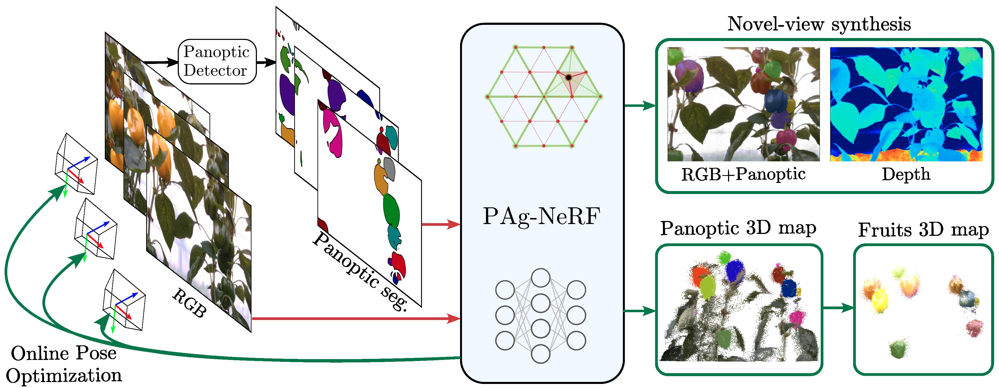
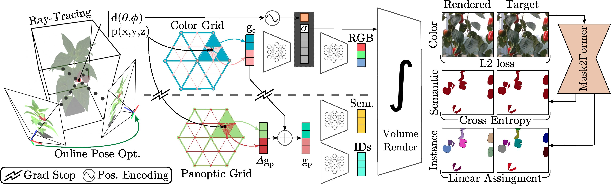

# [PAg-NeRF: Towards fast and efficient end-to-end panoptic 3D representations for agricultural robotics](https://lvisroot.github.io/pagnerf)


  <div align="center">
    <a href="http://claussmitt.com">
    Claus Smitt 🌱</a> &nbsp;&nbsp;
    <a href="http://agrobotics.uni-bonn.de/michael-halstead/">
    Michael Halstead 🌱</a>  &nbsp;&nbsp;
    <a href="http://agrobotics.uni-bonn.de/patrick-zimmer/">
    Patrick Zimmer 🌱</a> &nbsp;&nbsp;
    <a href="https://www.ipb.uni-bonn.de/people/thomas-laebe/">
    Thomas Läbe 📸</a> &nbsp;&nbsp;
    <a href="http://agrobotics.uni-bonn.de/esra-guclu/">
    Esra Guclu 🌱</a> &nbsp;&nbsp;
    <a href="https://www.ipb.uni-bonn.de/people/cyrill-stachniss/">
    Cyrill Stachniss 📸</a> &nbsp;&nbsp;
    <a href="https://sites.google.com/site/christophersmccool/">
    Chris McCool 🌱</a> &nbsp;&nbsp;
    <br><br>
    <a href="http://agrobotics.uni-bonn.de/">
    🌱 AgRobotics, Institute of Agriculture</a> &nbsp;&nbsp;&nbsp;&nbsp;
    <a href="https://www.ipb.uni-bonn.de/">
    📸 Institute of Photogrammetry</a>
    </br><a href="https://www.uni-bonn.de/">
  University of Bonn</a>
  </div>

### [Project Page](https://lvisroot.github.io/pagnerf) | [Pre-Print](https://arxiv.org/abs/2309.05339) | [Data](http://agrobotics.uni-bonn.de/sweet_pepper_dataset/)



**PAg-NeRF** uses state-of-the-art accelerated NeRFs and online pose optimization to produce 3D consistent panoptic representations of challenging agricultural environments.
<!-- ## TL;DR - Test Pre-Trained model -->

## Setup

Tested on Ubuntu 20.04; CUDA 11.7

- Install [CUDA and cuDDN](https://docs.nvidia.com/deeplearning/cudnn/install-guide/index.html).

- [Install Kaolin Wisp](https://kaolin-wisp.readthedocs.io/en/latest/pages/install.html) ([release 0.1.0](https://github.com/NVIDIAGameWorks/kaolin-wisp/releases/tag/v0.1.0)) for your CUDA version.
(This process will install [PyTorch](https://pytorch.org/) and NVIDIA's [Kaolin library](https://kaolin.readthedocs.io/en/latest/) in a [conda](https://conda.io/projects/conda/en/latest/index.html) environment)

- [Install Permutohedral Grid Encoding](https://github.com/RaduAlexandru/permutohedral_encoding#install) in the same `conda` environment.

Finally install PAg-NeRF requirements by running:
```
cd [path_to_pagnerf_repo]
conda activate wisp
pip install --upgrade pip
pip install -r requirements.txt
```

## Train a Model and Render outputs

```
cd [path_to_pagnerf_repo]

conda activate wisp

bash scripts/get_bup20.sh                         # ~70GB
bash scripts/get_bup20_mask2former_detections.sh  # ~58GB

python train.py
```

## Under The Hood



We use state-of-the-art permutohedral feature hash-grids to encode 3D space, allowing our system to be fast and memory efficient. Our architecture uses novel delta grid that computes panoptic features by correcting the color features, leveraging the similarity between modalities. Thanks to the implicit sparseness of hash-grids, we are able to reduce the panoptic capacity to only have valid values where corrections are needed.
We avoid propagating gradients from the panoptic to the color branch to ensure the panoptic grid only learns corrections over the color features. Our grid based architecture allows us to decoded all render quantities with very shallow MLPs. To learn 3D consistent instant IDs from inconsistent ID still-image predictions, we employ a modified linear assignment loss, tackling the fix scale nature of several agricultural datasets, rejecting repeated IDs. To obtain high-detail multi-view consistent renders, we also perform online pose optimization, making our system end-to-end trainable.


## Citation
```
@article{smitt2023pag,
    title={PAg-NeRF: Towards fast and efficient end-to-end panoptic 3D
           representations for agricultural robotics},
    author={Smitt Claus and Halstead Michael and Zimmer Patrick and
            Laebe Thomas and Guclu Esra and Stachniss Cyrill and McCool Chris},
    journal={arXiv preprint arXiv:2309.05339},
    year={2023}
}
```